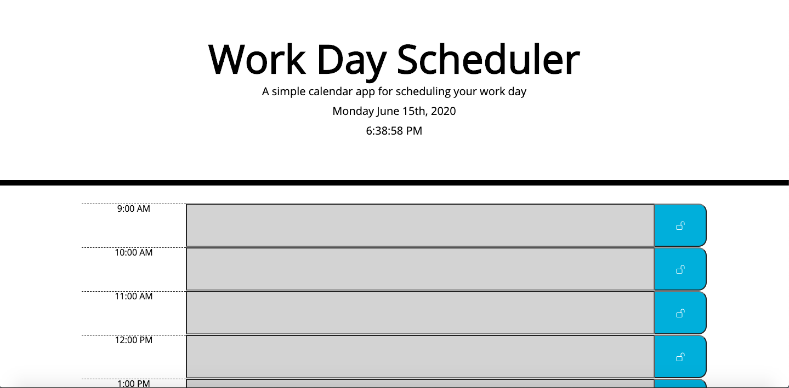
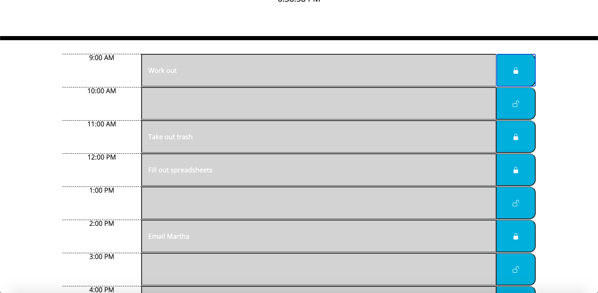
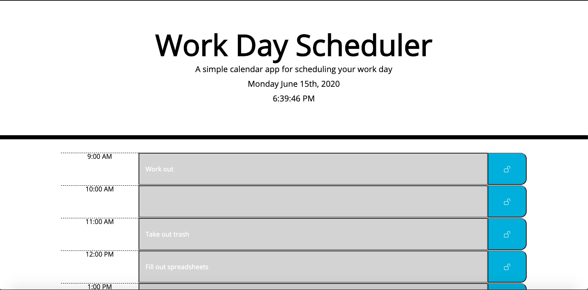

# Work Day Schedule
Application for organizing your time from 9-5 any day

---

## Description
Application that runs in browser and provides user with a schedule for a 9AM-5PM workday. Allows user to enter in to-dos, activities, or any input they choose and save the input to their browser's local storage. The user can then refresh the page or close the page and come back later to see their schedule items. The app uses moment.js API to update live time and date at the top of the page, then dynamically generates time slots with jQuery that are color-coded based on the current time of day. Features an intuitive, responsive design that reads and functions well on all device-widths.

---

## Table of Contents

* [Installation](#Installation)
* [Usage](#Usage)
* [Images](#Images)
* [Credits](#Credits)
* [Collaborators](#Collaborators)
* [License](#License)

---

## Installation
1. Clone the Github Repository [here](https://github.com/jameygronewald/workDaySchedule).
2. Open index.html in browser.

---

## Usage
* Visit the deployed app: [Work Day Schedule](https://jameygronewald.github.io/workDaySchedule/)
    1. Click on any time-slot (organized by hour of day from 9AM to 5PM) to enter in a task or activity. Slots that are grey represent hours that have already elapsed, the red slot is the current hour, and green slots are hours that have not yet come to pass.
    2. Click the save button to the right side of the time slot to save your task/activity for that slot so that it will remain even if you refresh the page.
    3. Schedule your day this way, and delete tasks as you complete them.
    4. App will automatically update with the correct day, date, and time.

---

## Images

---

## Credits
Thanks to Georgia Tech Coding Boot Camp for providing HTML and CSS template-code, and for providing the conceptual design.

---

## Collaborators
I, Jamey Gronewald, am the sole collaborator on this project.

---

## License

MIT License

Copyright (c) [2020] [Jamey Gronewald]

Permission is hereby granted, free of charge, to any person obtaining a copy
of this software and associated documentation files (the "Software"), to deal
in the Software without restriction, including without limitation the rights
to use, copy, modify, merge, publish, distribute, sublicense, and/or sell
copies of the Software, and to permit persons to whom the Software is
furnished to do so, subject to the following conditions:

The above copyright notice and this permission notice shall be included in all
copies or substantial portions of the Software.

THE SOFTWARE IS PROVIDED "AS IS", WITHOUT WARRANTY OF ANY KIND, EXPRESS OR
IMPLIED, INCLUDING BUT NOT LIMITED TO THE WARRANTIES OF MERCHANTABILITY,
FITNESS FOR A PARTICULAR PURPOSE AND NONINFRINGEMENT. IN NO EVENT SHALL THE
AUTHORS OR COPYRIGHT HOLDERS BE LIABLE FOR ANY CLAIM, DAMAGES OR OTHER
LIABILITY, WHETHER IN AN ACTION OF CONTRACT, TORT OR OTHERWISE, ARISING FROM,
OUT OF OR IN CONNECTION WITH THE SOFTWARE OR THE USE OR OTHER DEALINGS IN THE
SOFTWARE.